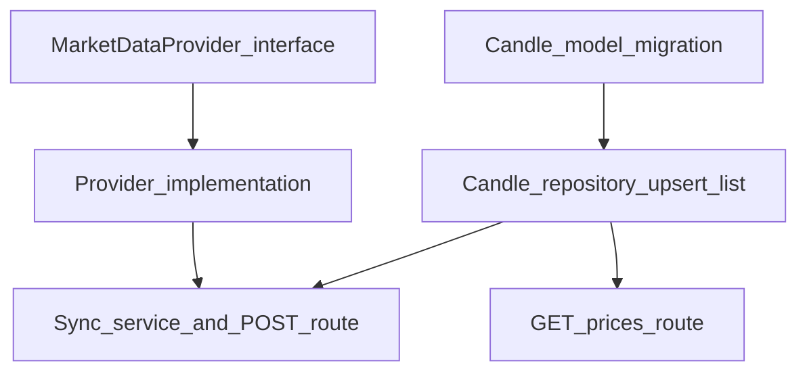

# Plano: Fase 4 — Market Data

## Escopo e alinhamento com o roadmap

Objetivo do roadmap: *“trazer o projeto para o mundo real”* com modelo `PriceHistory` ou `Candle`, camada de provider (`searchAssets`, `getQuote`, `getHistoricalPrices`), primeiro provider real, rota de sync e rota de histórico.

**Nota sobre numeração:** no topo do roadmap, “Etapas” lista *Portfolios* como item 4; nas seções `# Fase N`, a **Fase 4 é explicitamente Market Data**. Este plano segue as **fases detalhadas** (Fase 4 = Market Data).

## Estado atual relevante

- Modelo [`Asset`](prisma/schema.prisma) com `@@unique([symbol, exchange])` e repositório com [`findAssetBySymbolExchange`](src/modules/assets/repositories/assets.repository.ts).
- Rotas de ativos em [`src/modules/assets/routes.ts`](src/modules/assets/routes.ts) com `preHandler: [app.authenticate]` e padrão routes → schemas Zod → services → repository.
- [`env`](src/lib/env.ts) hoje: `DATABASE_URL`, `JWT_SECRET`, `PORT`, `NODE_ENV` — será necessário estender para chave(s) do provider escolhido.

## Decisões de arquitetura (recomendadas)

1. **Nome do modelo:** usar **`Candle`** (ou `PriceCandle`) com OHLCV + `interval` + `bucketStart` (timestamp UTC), em vez de “PriceHistory” genérico — facilita backtest/analytics nas fases seguintes e evolução para múltiplos timeframes.
2. **Chave na API:** preferir **`GET/POST /assets/:id/sync-prices` e `GET /assets/:id/prices`** em vez de só `:symbol`, porque:
   - evita ambiguidade entre bolsas (`symbol`+`exchange` já é único no banco, mas `:symbol` sozinho não);
   - evita conflito de roteamento com `GET /assets/:id` (hoje `:id` é cuid; rotas “por symbol” competem com “por id” se não forem ordenadas ou prefixadas).
   - Se quiser compatibilidade com o exemplo do roadmap (`:symbol`), alternativa: **`?exchange=` obrigatório** ou prefixo tipo `/assets/by-symbol/...` registrado **antes** de `/:id`.
3. **Provider:** interface TypeScript (contrato primeiro, alinhado ao skill [api-and-interface-design](skills/api-and-interface-design/SKILL.md)) com os três métodos sugeridos; implementação concreta em arquivo(s) dedicados; injeção simples (factory ou parâmetro no service) para testes.
4. **HTTP:** não há `axios` no projeto — usar **`fetch` nativo** (Node moderno) no primeiro provider.
5. **Sync:** primeira versão **síncrona na request** (aceitável para MVP); Fase 10 já prevê jobs/cron — documentar limite de volume/rate limit.

## Grafo de dependências (ordem de implementação)

Implementação em **fatias verticais** ([planning-and-task-breakdown](skills/planning-and-task-breakdown/SKILL.md)): após migration+repo, cada entrega deve deixar a API em estado testável (ex.: sync grava candles; GET lê do banco).

## Lista de tarefas

### Task 1: Modelo Prisma `Candle` + migration

**Descrição:** Adicionar modelo relacionado a `Asset` com campos mínimos: `assetId`, `interval` (enum ex.: `DAY`), `bucketStart` (DateTime UTC), `open`, `high`, `low`, `close`, `volume` (Decimal/BigInt conforme convenção do projeto), `createdAt`. Índice composto único `(assetId, interval, bucketStart)` para idempotência de upsert.

**Critérios de aceite:**
- Migration aplicável sem quebrar `Asset` existente.
- Unicidade impede duplicata do mesmo candle.

**Verificação:** `prisma migrate dev` + `prisma generate` sem erros.

**Dependências:** nenhuma.

**Arquivos:** [`prisma/schema.prisma`](prisma/schema.prisma), `prisma/migrations/...`

**Escopo:** M.

---

### Task 2: Repositório de candles (upsert em lote + listagem por intervalo)

**Descrição:** Funções para: (1) upsert de many candles após sync; (2) `listCandlesByAssetAndRange(assetId, interval, from, to)` ordenado por `bucketStart`.

**Critérios de aceite:**
- Consulta usa índices definidos no schema.
- Upsert não cria duplicatas na reexecução do sync para o mesmo período.

**Verificação:** teste manual via Prisma Studio ou script curto (testes automatizados podem ficar para Fase 9 se ainda não houver infra de teste).

**Dependências:** Task 1.

**Arquivos:** novo `src/modules/market-data/repositories/candles.repository.ts` (ou sob `assets/` se preferir módulo único — recomendação: **`market-data`** para separar domínio).

**Escopo:** M.

---

### Task 3: Contrato `MarketDataProvider` + tipos compartilhados

**Descrição:** Definir interface com `searchAssets`, `getQuote`, `getHistoricalPrices` (assinaturas alinhadas ao roadmap), tipos de entrada/saída neutros (sem acoplar ao Prisma).

**Critérios de aceite:**
- Interface estável e documentada no código (JSDoc breve nos métodos).
- Erros do provider mapeados para erros de domínio (ex.: `MarketDataProviderError`, `RateLimitedError`) usados nas rotas.

**Verificação:** `npm run build` passa.

**Dependências:** nenhuma (paralela à Task 2 após Task 1, mas integração depende de Task 2).

**Arquivos:** `src/modules/market-data/providers/market-data-provider.ts` (nome ajustável).

**Escopo:** S.

---

### Task 4: Primeiro provider real + variáveis de ambiente

**Descrição:** Implementar um provider concreto (ex.: **Alpha Vantage**, **Twelve Data**, **Polygon** — escolha final define formato da API e parsing). Estender [`src/lib/env.ts`](src/lib/env.ts) com `SOME_PROVIDER_API_KEY` (nome explícito). Normalizar símbolo/intervalo entre API externa e modelo interno.

**Critérios de aceite:**
- `getHistoricalPrices` retorna série compatível com o upsert da Task 2.
- Falha de rede / HTTP 4xx/5xx vira erro tratável (não estoura stack crua na rota).

**Verificação:** chamada isolada (script ou teste) com key válida em ambiente local.

**Dependências:** Task 3.

**Arquivos:** `src/modules/market-data/providers/<nome>.provider.ts`, [`src/lib/env.ts`](src/lib/env.ts), `.env.example` se existir no repo.

**Escopo:** M–L (depende da API escolhida).

---

### Task 5: Service de sync + `POST /assets/:id/sync-prices`

**Descrição:** Resolver `Asset` por `id`; se não existir → 404. Chamar provider para intervalo default (ex.: últimos N dias configurável por query `from`/`to` opcionais com validação Zod). Persistir candles via repositório.

**Critérios de aceite:**
- Rota protegida por `app.authenticate` (consistente com assets).
- Validação de query/body com Zod.
- Resposta clara: quantidade inserida/atualizada ou período vazio.

**Verificação:** manual: criar asset no seed, chamar sync, conferir DB.

**Dependências:** Tasks 2 e 4.

**Arquivos:** `src/modules/market-data/services/sync-asset-prices.service.ts`, estender rotas em [`src/modules/assets/routes.ts`](src/modules/assets/routes.ts) **ou** registrar sub-rotas em [`src/app/app.ts`](src/app/app.ts) com ordem correta (rotas mais específicas antes de `/:id` se necessário).

**Escopo:** M.

---

### Task 6: `GET /assets/:id/prices` com `from` / `to` / `interval`

**Descrição:** Listar candles do banco para o ativo; validar intervalo de datas e `interval`; paginação opcional (limit cap) se volumes forem grandes.

**Critérios de aceite:**
- 404 se asset inexistente.
- Ordenação estável por tempo.
- Query params com Zod (coerção de datas ISO).

**Verificação:** manual + `npm run build`.

**Dependências:** Task 2 (e Task 5 para dados de exemplo).

**Arquivos:** service + schema + rota no mesmo módulo de market-data.

**Escopo:** M.

---

## Checkpoints

- **Após Tasks 1–2:** migration ok; upsert + leitura no DB validados.
- **Após Tasks 3–5:** fluxo E2E: autenticar → sync → GET retorna série.
- **Após Task 6:** contrato de leitura fechado para Fase 6 (Analytics).

## Riscos e mitigações

| Risco | Impacto | Mitigação |
|--------|---------|-----------|
| Rate limit / ToS de API gratuita | Alto | Escolher provider com limites claros; limitar range default; documentar no README |
| Símbolo não bate com provider | Médio | Documentar convenção (ex.: `PETR4.SA`); opcional: campo `providerSymbol` no Asset (fora do MVP se não necessário) |
| Sync longo na request | Médio | Range default pequeno; aceitar `from`/`to`; evoluir para job na Fase 10 |

## Questões em aberto (decisão humana)

1. **Qual provider “real” primeiro?** (impacta env vars, formato de símbolo e parsing.)
2. **Rotas por `id` vs `symbol`:** recomendação acima é `id`; confirmar se o produto exige obrigatoriamente `:symbol` na URL.
