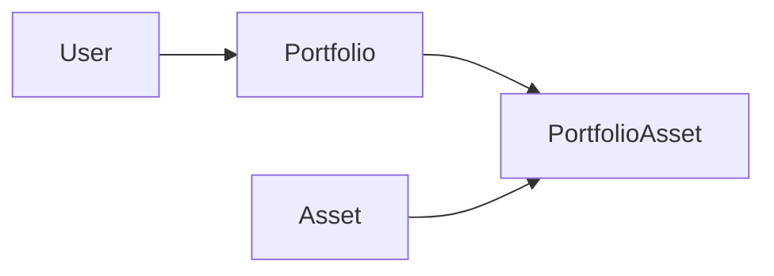
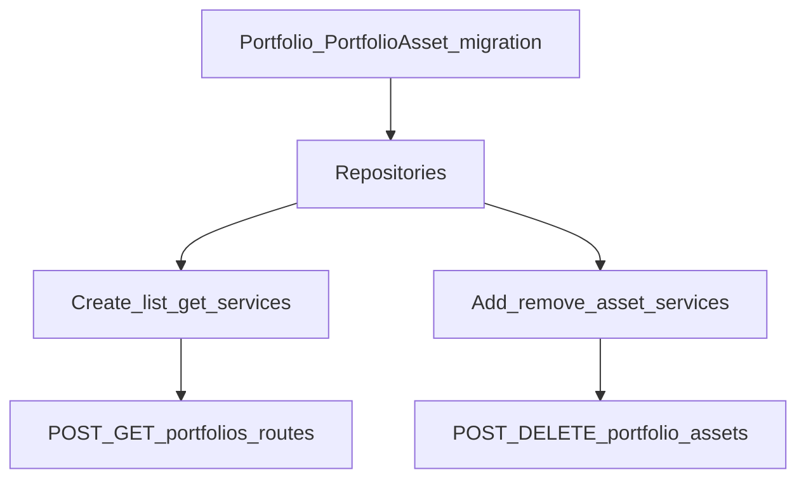

# Plano: Fase 5 — Portfolios

## Escopo (roadmap)

- Modelos `Portfolio` e `PortfolioAsset`.
- Criar carteira, listar do usuário, obter por id, adicionar ativo, remover ativo.
- Suporte a **pesos ou quantidades** por linha da carteira.
- Rotas: `POST /portfolios`, `GET /portfolios`, `GET /portfolios/:id`, `POST /portfolios/:id/assets`, `DELETE /portfolios/:id/assets/:assetId`.

## Contexto no código hoje

- Autenticação: `preHandler: [app.authenticate]` + `request.user.sub` como id do usuário ([`src/modules/users/routes.ts`](src/modules/users/routes.ts)).
- Registro de rotas em [`src/app/app.ts`](src/app/app.ts) — será preciso registrar `portfoliosRoutes` com prefixo `/portfolios`.
- Padrão existente: `routes` → schemas Zod → `services` → `repositories` + erros de domínio (ex.: [`src/modules/assets`](src/modules/assets)).
- `User` ainda não tem relações no Prisma; `Asset` é catálogo global (sem `userId`).

## Decisões de arquitetura

1. **Dono da carteira:** `Portfolio.userId` → `User` (`onDelete: Cascade` ou `Restrict` — cascade é simples para MVP).
2. **Junction `PortfolioAsset`:** `portfolioId`, `assetId`, campos opcionais mutuamente exclusivos:
   - `targetWeight` (`Decimal`, nullable) — fração 0–1 ou percentual documentado na API (recomendação: **0–1** para alinhar com analytics/backtest depois).
   - `quantity` (`Decimal`, nullable) — unidades do ativo.
   - Regra de negócio: exatamente um dos dois preenchido em `POST .../assets`; validação no service + Zod (`.refine`).
3. **Unicidade:** `@@unique([portfolioId, assetId])` para não duplicar o mesmo ativo na mesma carteira.
4. **Autorização:** em toda rota que recebe `:id` da carteira, carregar `Portfolio` por `id` + `userId === request.user.sub`; se não existir → **404** (não revelar se a carteira é de outro usuário), alinhado a boas práticas de API ([api-and-interface-design](skills/api-and-interface-design/SKILL.md)).
5. **Respostas:** `GET /portfolios/:id` pode incluir `assets` aninhados (join Prisma `include`) para o cliente montar a UI sem N+1.

## Ordem de implementação (grafo)

Fatias verticais: primeiro “carteira vazia” (schema → criar/listar/detalhe), depois “posições” (adicionar/remover).

## Tarefas

### Task 1: Modelos Prisma `Portfolio` e `PortfolioAsset` + migration

**Descrição:** `Portfolio`: `id`, `userId`, `name`, `createdAt`, `updatedAt` (opcional `description` se quiser enriquecer sem custo). `PortfolioAsset`: `id` ou chave composta — usar `id` cuid + `@@unique([portfolioId, assetId])`, `targetWeight` e `quantity` como `Decimal?` no Postgres.

**Critérios de aceite:**
- Migration aplicável; `User` passa a ter `portfolios Portfolio[]` (ou equivalente via back-relation).
- `Asset` com `portfolioAssets PortfolioAsset[]` para integridade referencial.

**Verificação:** `prisma migrate dev` + `prisma generate` + `npm run build`.

**Dependências:** nenhuma.

**Arquivos:** [`prisma/schema.prisma`](prisma/schema.prisma), `prisma/migrations/...`

**Escopo:** M.

---

### Task 2: Repositórios de portfolio e linhas

**Descrição:** Funções mínimas: `createPortfolio`, `listPortfoliosByUserId`, `findPortfolioByIdForUser`, `addPortfolioAsset`, `removePortfolioAsset`, `findPortfolioAsset` (para idempotência/erros). Usar `include: { assets: { include: { asset: true } } }` onde fizer sentido para o GET por id.

**Critérios de aceite:**
- Consultas filtram sempre por `userId` quando aplicável.
- `addPortfolioAsset` respeita unique `(portfolioId, assetId)`.

**Verificação:** smoke manual via Prisma Studio ou script curto.

**Dependências:** Task 1.

**Arquivos:** novo diretório `src/modules/portfolios/repositories/`.

**Escopo:** M.

---

### Task 3: Erros de domínio + schemas Zod

**Descrição:** Erros tipo `PortfolioNotFoundError`, `AssetNotFoundError` (reutilizar padrão de assets se existir método de lookup), `DuplicatePortfolioAssetError`, `InvalidAllocationError` (peso e quantidade inválidos ou ambos ausentes/ambos preenchidos). Schemas: body `POST /portfolios`, body `POST .../assets` (assetId + weight XOR quantity).

**Critérios de aceite:**
- Mensagens estáveis para o cliente; rotas mapeiam para 404/409/400.

**Verificação:** `npm run build`.

**Dependências:** Task 1 (tipos/enums).

**Arquivos:** `src/modules/portfolios/services/errors.ts`, `src/modules/portfolios/schemas/portfolios.schemas.ts`.

**Escopo:** S–M.

---

### Task 4: Serviços — criar, listar, obter por id

**Descrição:** Implementar serviços chamados pelas rotas; `GET /portfolios/:id` retorna carteira + ativos (com dados resumidos do `Asset`: symbol, name, exchange).

**Critérios de aceite:**
- Apenas o dono acessa (via repositório com `userId`).

**Verificação:** manual após Task 6 parcial (rotas básicas).

**Dependências:** Tasks 2–3.

**Arquivos:** `src/modules/portfolios/services/*.service.ts`.

**Escopo:** M.

---

### Task 5: Serviços — adicionar e remover ativo

**Descrição:** `POST /portfolios/:id/assets`: validar que `assetId` existe em `Asset`; inserir linha com peso **ou** quantidade. `DELETE`: remover linha; 404 se carteira ou vínculo não existir.

**Critérios de aceite:**
- Ativo inexistente no catálogo → 404 ou 400 com mensagem clara (escolher uma política e documentar).
- Duplicar ativo na mesma carteira → 409.

**Verificação:** fluxo manual: criar carteira → adicionar AAPL → listar → remover.

**Dependências:** Tasks 2–4.

**Escopo:** M.

---

### Task 6: Rotas Fastify + registro no app

**Descrição:** Criar [`src/modules/portfolios/routes.ts`](src/modules/portfolios/routes.ts) com `preHandler: [app.authenticate]` em todas as rotas; registrar em [`src/app/app.ts`](src/app/app.ts) com `prefix: "/portfolios"`.

**Critérios de aceite:**
- Rotas exatamente como no roadmap (métodos HTTP: `POST` e `GET` conforme especificado; `DELETE` para remoção).
- Parâmetro `assetId` na URL do DELETE alinhado ao modelo (`assetId` do `Asset`, não o id da linha `PortfolioAsset`, a menos que prefira — o roadmap diz `:assetId`, usar id do ativo).

**Verificação:** `npm run build`; teste manual com token JWT.

**Dependências:** Tasks 4–5.

**Escopo:** M.

---

### Task 7 (opcional, pequeno): Seed

**Descrição:** Estender [`prisma/seed.ts`](prisma/seed.ts) com uma carteira de exemplo para um usuário seed (se o projeto tiver usuário seed; caso contrário, omitir ou documentar criação só via API).

**Critérios de aceite:** Seed roda sem erro quando aplicável.

**Dependências:** Task 1.

**Escopo:** S (se couber no escopo; senão deixar para Fase 9).

## Checkpoints

- **Após Task 1–2:** DB e repositórios prontos.
- **Após Task 4–6:** fluxo E2E: login → criar carteira → listar → GET id → add asset → DELETE asset.
- **Completo:** roadmap Fase 5 atendido; Fase 6 pode consumir carteiras + candles.

## Riscos e mitigações

| Risco | Mitigação |
|--------|-----------|
| Semântica de peso (0–1 vs %) | Documentar no contrato da API e fixar no Zod (ex.: `0 < weight <= 1`). |
| Misturar linhas só com peso e só com quantidade na mesma carteira | MVP: permitir; Fase 6 pode exigir modo único ou normalizar. |
| Performance em `GET` com muitos ativos | `take` opcional no futuro; por ora lista completa. |

## Questão em aberto (decisão de produto)

- **Peso:** usar fração **0–1** (recomendado para quant) ou percentual 0–100? O plano assume **0–1** com validação Zod; ajuste se o front já esperar outro formato.
