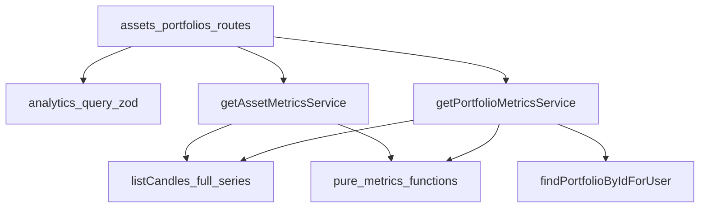

# Plano: Fase 6 — Analytics

## Escopo (roadmap)

- Endpoint de métricas **por ativo** e **por carteira**.
- Métricas: retorno acumulado, volatilidade, volatilidade anualizada, Sharpe, Sortino, max drawdown, drawdown duration.

## Estado atual útil

- Séries diárias em [`Candle`](prisma/schema.prisma) (`interval` = `DAY`, `bucketStart`, `close`).
- Leitura existente em [`listCandlesByAssetAndRange`](src/modules/market-data/repositories/candles.repository.ts) com `take` cap (2000) — para analytics pode **truncar** janelas longas; o plano prevê função dedicada ou parâmetro “sem paginação” com **limite de janela** validado no Zod (ex.: máx. ~15 anos em dias úteis ou 4000 pontos).
- Carteiras: [`PortfolioAsset`](prisma/schema.prisma) com `targetWeight` **ou** `quantity` (XOR na entrada), mas o banco permite **misturar** linhas peso vs quantidade.
- Rotas: padrão JWT + `request.user.sub`; registrar rotas **mais específicas antes** de `GET /:id` (igual `sync-prices` / `prices` em [assets](src/modules/assets/routes.ts)).

## Decisões de produto / quant (MVP)

1. **Série de preços:** usar **preço de fechamento** diário; retornos **simples** \(r_t = P_t/P_{t-1} - 1\) (simples de explicar; opcional trocar para log depois).
2. **Anualização:** \(\sigma_{\text{ann}} = \sigma_{\text{daily}} \sqrt{252}\); Sharpe/Sortino com o mesmo fator (premissa **252 dias úteis**; documentar na resposta ou README).
3. **Taxa livre de risco:** default **0** (configurável depois via `env`, ex. `ANALYTICS_RISK_FREE_ANNUAL`, opcional nesta fase).
4. **Sharpe:** \((\mu_{\text{daily}} - r_f/252) / \sigma_{\text{daily}} \times \sqrt{252}\) com \(\sigma\) desvio padrão amostral dos retornos (ddof=1 opcional — fixar uma convenção e usar em todo lugar).
5. **Sortino:** usar desvio padrão apenas dos retornos **abaixo** de 0 (ou abaixo de \(r_f/252\)); se denominador 0, retornar `null` ou omitir com mensagem — definir no contrato JSON.
6. **Max drawdown:** sobre **curva de patrimônio normalizada** \(W_t = \prod_{k \le t}(1+r_k)\) com \(W_0=1\); **maxDrawdown** = \(\min_t (W_t / \max_{s\le t} W_s - 1)\) (valor ≤ 0).
7. **Drawdown duration (MVP):** **duração do episódio de max drawdown** = número de **períodos** (dias com retorno) entre o **pico** (último máximo global antes do vale que atinge o max DD) e o **vale** (mínimo local onde o drawdown atinge o mínimo). Se houver empates, usar primeira ocorrência. Alternativa documentada: se preferir “tempo até recuperação”, deixar para evolução (Fase 10).
8. **Carteira só com pesos:** retorno diário \(r_{p,t} = \sum_i w_i\, r_{i,t}\) com pesos **fixos** informados (já somam ~1 por validação futura; se não somarem 1, **normalizar** os pesos para soma 1 com aviso opcional no JSON ou 400 — recomendação: **normalizar** e incluir `weightsNormalized: true` só se necessário).
9. **Carteira só com quantidades:** valor \(V_t = \sum_i q_i P_{i,t}\); retorno \(r_{p,t} = V_t/V_{t-1} - 1\) após alinhar preços por data (**inner join** de datas com preço disponível para todos os ativos).
10. **Carteira mista (peso + quantidade em linhas diferentes):** MVP recomendado: **400** com mensagem estável (`MIXED_ALLOCATION_NOT_SUPPORTED`) — evita semântica ambígua antes da Fase 6 consumir FX.
11. **Moeda única implícita:** não há FX; ativos em moedas diferentes na mesma carteira geram métricas **sem sentido econômico** — documentar limite; opcional validar que todas as `currency` das posições são iguais e senão **422** (boa entrega se couber em uma task pequena).

## Forma da API (proposta)

| Método | Rota | Auth |
|--------|------|------|
| GET | `/assets/:id/metrics?from=&to=` | JWT |
| GET | `/portfolios/:id/metrics?from=&to=` | JWT |

- `from` / `to`: datas (ISO); intervalo **inclusivo** coerente com [`listCandlesByAssetAndRange`](src/modules/market-data/repositories/candles.repository.ts).
- Resposta JSON com objeto `metrics` (nomes em camelCase) + `period` (`from`, `to`, `observations`).

Registrar **`/:id/metrics` antes de `/:id`** em [assets](src/modules/assets/routes.ts) e [portfolios](src/modules/portfolios/routes.ts).

## Arquitetura de código

- **Fatia 1 (fundação):** funções puras em algo como [`src/modules/analytics/metrics.ts`](src/modules/analytics/metrics.ts) (ou `src/lib/analytics/metrics.ts`) — sem Prisma, fáceis de testar depois.
- **Fatia 2:** leitura de candles para analytics (novo método no repositório ou arquivo ao lado de market-data, reutilizando `prisma`).
- **Fatia 3:** endpoint ativo (vertical completo).
- **Fatia 4:** endpoint carteira + regras de alocação + alinhamento de datas.

## Lista de tarefas

### Task 1: Biblioteca pura de métricas

**Descrição:** Implementar a partir de array de retornos diários (number[]): cumulativeReturn, volatilityDaily, volatilityAnnualized, sharpe, sortino, maxDrawdown, maxDrawdownDurationPeriods (+ talvez série auxiliar para testes internos).

**Critérios de aceite:** Comportamento definido para arrays curtos (ex.: &lt; 2 pontos → erro tipado ou resultado vazio tratado no service); Sortino com denominador 0 → valor nulo ou erro documentado.

**Verificação:** `npm run build`; testes unitários se já existir runner (senão checklist manual com planilha).

**Dependências:** nenhuma.

**Escopo:** S–M.

---

### Task 2: Acesso a dados — série de fechamentos

**Descrição:** Função `listDailyClosesInRange(assetId, from, to)` (ou reutilizar `listCandlesByAssetAndRange` com `take` alto) garantindo ordenação ascendente e **sem buracos** tratados no service (forward-fill opcional fora do MVP — MVP: usar apenas datas com candle para ativo; carteira usa **interseção** de datas).

**Critérios de aceite:** Janela máxima validada no Zod para não estourar memória.

**Verificação:** smoke com seed + sync de preços.

**Dependências:** Task 1 conceitualmente independente, mas integração após Task 3.

**Arquivos:** [`candles.repository.ts`](src/modules/market-data/repositories/candles.repository.ts) ou novo arquivo em `analytics/repositories`.

**Escopo:** S.

---

### Task 3: Schemas + erros de domínio

**Descrição:** `metricsQuerySchema` (from, to, limites); erros `InsufficientPriceDataError`, `MixedPortfolioAllocationError`, opcional `CurrencyMismatchError`.

**Verificação:** `npm run build`.

**Dependências:** nenhuma.

**Escopo:** S.

---

### Task 4: Serviço + rota `GET /assets/:id/metrics`

**Descrição:** Validar asset existe ([`getAssetById`](src/modules/assets/services/get-asset.service.ts) ou repo); buscar closes; computar métricas; 404 se sem dados mínimos.

**Verificação:** manual com token.

**Dependências:** Tasks 1–3.

**Escopo:** M.

---

### Task 5: Serviço + rota `GET /portfolios/:id/metrics`

**Descrição:** Garantir posse (`findPortfolioByIdForUser`); rejeitar mistura peso/quantidade; montar retornos (pesos vs quantidades); mesmas métricas do ativo.

**Verificação:** manual: carteira 2 ativos com pesos, período com candles em ambos.

**Dependências:** Tasks 1–4.

**Escopo:** M–L.

---

### Task 6: Registro e ordem de rotas

**Descrição:** Incluir handlers em [assets](src/modules/assets/routes.ts) e [portfolios](src/modules/portfolios/routes.ts) na ordem correta; manter tratamento de erros consistente (404/400/422).

**Verificação:** `npm run build`; smoke curl.

**Dependências:** Tasks 4–5.

**Escopo:** S.

---

## Checkpoints

- Após Task 1: métricas reproduzíveis offline.
- Após Task 4: ativo ponta a ponta.
- Após Task 6: carteira ponta a ponta.

## Riscos

| Risco | Mitigação |
|--------|-----------|
| Poucos dados | Mínimo de observações na validação; mensagem clara |
| `take` 2000 | Query dedicada ou aumentar limite só para analytics + teto de `from`/`to` |
| Sharpe/Sortino sensíveis a outliers | Documentar premissas; Fase 8 quantix pode substituir |
| Multimoeda | Validar currency única ou documentar “use por sua conta” |

## Escopo fora (explícito)

- Persistir snapshots de métricas em DB.
- Benchmarks, VaR, beta.
- Frequências além de `DAY`.
