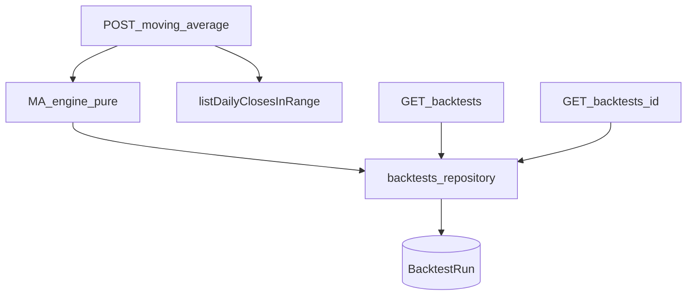

# Plano: Fase 7 — Backtests

## Escopo (roadmap)

- Model `BacktestRun`.
- Endpoint para rodar estratégia **moving average crossover**: capital inicial, período, resultado persistido, **equity curve**, comparação com **buy and hold**.
- Rotas: `POST /backtests/moving-average`, `GET /backtests`, `GET /backtests/:id`.

## Contexto no código

- Séries diárias em [`Candle`](prisma/schema.prisma); leitura ascendente já existe em [`listDailyClosesInRange`](src/modules/market-data/repositories/candles.repository.ts) (cap 4000 barras — alinhar validação de `from`/`to` ao mesmo teto ou ao schema de analytics).
- Usuário autenticado: `request.user.sub` ([`users/routes.ts`](src/modules/users/routes.ts)).
- Registro de plugins em [`src/app/app.ts`](src/app/app.ts) — novo `backtestsRoutes` com prefixo `/backtests`.
- Padrão: Zod → service → repository + erros de domínio.

## Decisões de arquitetura

### 1. Escopo da primeira estratégia (MVP)

- **Um ativo por run** (`assetId` no body): MA crossover clássico em **fechamento**.
- **Long / cash** (sem short): posição investida quando `SMA(fast) > SMA(slow)` no dia de **sinal**, aplicada ao **retorno do dia seguinte** para evitar *lookahead* com o fechamento do mesmo dia:
  - `position[t] ∈ {0,1}` derivado de `SMA_fast[t] > SMA_slow[t]` após período de warmup (`t >= slowPeriod - 1` em índice 0-based nos preços alinhados).
  - Retorno da estratégia no intervalo `t → t+1`: `position[t] * r_{t+1}` com `r_{t+1} = P[t+1]/P[t] - 1`.
  - Antes do warmup: posição 0 e equity flat ou só acumula depois do primeiro índice válido — documentar na resposta (`warmupBars`).
- **Buy and hold**: compra no primeiro preço utilizado da série (após warmup opcional alinhado ao primeiro passo da estratégia ou desde `P[0]` — recomendação: **mesmo primeiro índice da equity da estratégia** para comparar apple-to-apple).

### 2. Persistência

- Tabela **`BacktestRun`** com campos escalares para consulta/listagem e **JSON** para séries (evita migrações pesadas no MVP):

  - `id`, `userId`, `assetId`, `createdAt`.
  - `strategy` fixo ou enum Prisma ex.: `MOVING_AVERAGE_CROSSOVER`.
  - `initialCapital` (`Decimal`), `periodStart`, `periodEnd` (`DateTime`).
  - Parâmetros: `fastPeriod`, `slowPeriod` (`Int`) ou `params Json` — colunas separadas simplificam filtros futuros.
  - `summary Json`: totais normalizados (`strategyTotalReturn`, `buyHoldTotalReturn`, `finalEquityStrategy`, `finalEquityBuyHold`, `warmupBars`, talvez `tradingDays`).
  - `series Json`: array limitado `{ bucketStart: ISO, strategyEquity: number, buyHoldEquity: number }[]` (mesmo comprimento útil pós-warmup).

- Relações: `User` → `backtests BacktestRun[]`; `Asset` → `backtestRuns BacktestRun[]` (`onDelete` Restrict no asset).

### 3. Validação de entrada (Zod)

- `assetId`, `from`, `to`, `initialCapital > 0`, `fastPeriod`, `slowPeriod` inteiros com `slowPeriod > fastPeriod >= 2`.
- Refinar janela de datas (igual ou mais estrita que analytics, ex. ≤ 4000 dias) e garantir candles suficientes: `observations >= slowPeriod + 1` (ou regra explícita no service).

### 4. Motor puro

- Novo arquivo tipo [`src/modules/backtests/engine/moving-average-crossover.ts`](src/modules/backtests/engine/moving-average-crossover.ts) (sem Prisma): entrada `closes[]`, `dates[]`, parâmetros → saída `{ summary, series }`.
- Reutilizar convenções numéricas de [`closesToSimpleReturns`](src/modules/analytics/metrics.ts) onde fizer sentido (sem acoplar métricas obrigatoriamente nesta fase).

### 5. Autorização

- `POST` e `GET` filtram por `userId === request.user.sub`.
- `GET /backtests/:id`: 404 se não existir ou não for do usuário (mesmo padrão de carteiras).

### 6. Erros HTTP

- Asset inexistente → 404 (reutilizar [`AssetNotFoundError`](src/modules/assets/services/errors.ts) ou erro local).
- Dados insuficientes / período inválido → 400 com mensagem estável + `code` opcional (espelhar [`InsufficientPriceDataError`](src/modules/analytics/services/errors.ts) ou erro dedicado `InsufficientHistoryForBacktestError`).
- Parâmetros MA inválidos → 400 (Zod ou domain).

## Lista de tarefas

### Task 1: Modelo `BacktestRun` + migration

**Descrição:** Campos escalares + `summary`/`series` `Json`; FK `userId`, `assetId`; índices `userId`, `createdAt`.

**Aceite:** Migration aplicável; `User`/`Asset` com back-relations.

**Verificação:** `prisma migrate dev` + `prisma generate` + `npm run build`.

**Escopo:** M.

---

### Task 2: Motor MA crossover + equity / buy-and-hold

**Descrição:** SMA rolling O(n), regra de posição e construção das séries de patrimônio; documentar warmup e ausência de short no JSDoc.

**Aceite:** Séries monótonas coerentes com capital inicial; buy-and-hold referenciado ao mesmo horizonte comparável.

**Verificação:** testes unitários se houver runner; senão script/assert rápido manual.

**Escopo:** M.

---

### Task 3: Repositório + schemas Zod + erros

**Descrição:** `createBacktestRun`, `listBacktestsByUser`, `findBacktestByIdForUser`; body schema `POST`; erros de domínio.

**Aceite:** Listagem ordenada por `createdAt desc` (padrão razoável).

**Verificação:** `npm run build`.

**Escopo:** S–M.

---

### Task 4: Serviço `runMovingAverageBacktest`

**Descrição:** Resolver asset; carregar closes no período; validar comprimento; executar motor; persistir `BacktestRun`; retornar DTO compatível com `GET :id`.

**Aceite:** Transação opcional (create único); JSON serializável.

**Verificação:** smoke manual com token + dados seed/sync.

**Escopo:** M.

---

### Task 5: Rotas Fastify

**Descrição:** [`src/modules/backtests/routes.ts`](src/modules/backtests/routes.ts): `POST /moving-average`, `GET /`, `GET /:id` com `preHandler: [app.authenticate]`; registrar em [`app.ts`](src/app/app.ts).

**Aceite:** Rotas exatamente como roadmap (prefix `/backtests`).

**Verificação:** `npm run build`; chamadas curl.

**Escopo:** M.

---

### Task 6 (checkpoint): Limites e contrato da resposta

**Descrição:** Documentar no código ou resposta os campos `assumptions` (252 dias, execução no fechamento, long/cash) espelhando o padrão de [`get-asset-metrics.service.ts`](src/modules/analytics/services/get-asset-metrics.service.ts).

**Aceite:** Cliente distingue equity estratégia vs buy-and-hold.

**Escopo:** S.

---

## Riscos

| Risco | Mitigação |
|--------|-----------|
| JSON grande | Cap de pontos na série + mesmo limite de datas dos candles |
| Semântica MA ambígua | Documentar no payload `assumptions` |
| performance O(n × período MA) | SMA incremental O(n) |

## Fora do escopo (Fase 7)

- Custos, slippage, short, multi-ativo, outros timeframes.
- Integração `quantix` (Fase 8).
