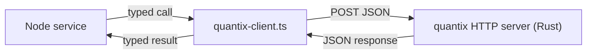
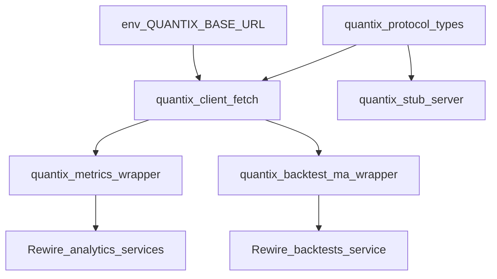

# Plano: Fase 8 -- Integracao com quantix

## Escopo (roadmap)

Objetivo: *"As metricas e backtests deixam de ser 'logica JS' e passam a ser powered by quantix."*

Abordagem escolhida: **Microservice HTTP** (arquitetura mais limpa conforme roadmap). A API Node faz requests HTTP (fetch) a um servico Rust separado que expoe endpoints REST JSON.

## Estado atual relevante

Duas superficies de calculo **puro** candidatas a substituicao:

1. **Metricas de risco** em [`src/modules/analytics/metrics.ts`](src/modules/analytics/metrics.ts): `metricsFromSimpleDailyReturns` (cumReturn, vol, Sharpe, Sortino, maxDD, DD duration) consumida por [`get-asset-metrics.service.ts`](src/modules/analytics/services/get-asset-metrics.service.ts) e [`get-portfolio-metrics.service.ts`](src/modules/analytics/services/get-portfolio-metrics.service.ts).
2. **Backtest MA crossover** em [`src/modules/backtests/engine/moving-average-crossover.ts`](src/modules/backtests/engine/moving-average-crossover.ts): `runMovingAverageCrossover` consumida por [`backtests.service.ts`](src/modules/backtests/services/backtests.service.ts).

Ambas sao funcoes puras (entrada = arrays numericos, saida = objetos) -- ideais para chamada HTTP com JSON body/response.

## Decisoes de arquitetura

### 1. Microservice HTTP (fetch nativo)



- O servico Rust expoe endpoints REST:
  - `POST /metrics` -- recebe retornos diarios, devolve metricas.
  - `POST /backtest/moving-average` -- recebe closes/params, devolve equity curve + summary.
  - `GET /health` -- health check para validar que o servico esta up.
- Comunicacao via `fetch` nativo (ja usado no projeto para Alpha Vantage).
- Timeout configuravel em env (`QUANTIX_TIMEOUT_MS`, default 30000).

### 2. Feature-flag e fallback

Nova env var `QUANTIX_BASE_URL` (opcional, ex.: `http://localhost:4000`):
- Se **definida** e health check responde: usa Rust.
- Se **vazia / undefined / servico indisponivel**: cai na logica TS existente com log de aviso.

Isso permite:
- Desenvolver o lado Node **agora**, testar com stub server.
- Ligar o Rust quando o servico estiver rodando, sem deploy acoplado.
- Rollback instantaneo removendo a env var.
- Em producao: o servico Rust roda em container separado (Docker Compose na Fase 9).

### 3. Contrato JSON (protocol)

Definir **tipos TypeScript** que espelham os endpoints do Rust. Criar um arquivo `quantix-protocol.ts` com:

```typescript
// POST /metrics
type QuantixMetricsInput = {
  returns: number[];
  riskFreeAnnual: number;
};
type QuantixMetricsOutput = ReturnSeriesMetrics; // mesmo tipo do TS atual

// POST /backtest/moving-average
type QuantixBacktestMaInput = {
  closes: number[];
  dates: string[];    // ISO
  fastPeriod: number;
  slowPeriod: number;
  initialCapital: number;
};
type QuantixBacktestMaOutput = MovingAverageCrossoverResult; // mesmo tipo
```

**Sem alteracao nos contratos da API HTTP publica** (responses identicas para o cliente). A troca e interna.

### 4. Organizacao de codigo

Novo diretorio `src/lib/quantix/`:
- `quantix-protocol.ts` -- tipos de I/O e paths dos endpoints.
- `quantix-client.ts` -- cliente HTTP generico `callQuantix<TIn, TOut>(path, input)` com timeout, health check lazy e parsing tipado.
- `quantix-metrics.ts` -- wrapper que chama client ou fallback TS para metricas.
- `quantix-backtest-ma.ts` -- wrapper que chama client ou fallback TS para MA crossover.

Os services existentes passam a importar os wrappers em vez das funcoes puras diretamente.

### 5. Stub server para testes locais sem Rust

Um script `scripts/quantix-stub-server.ts` que sobe um Fastify minimo na porta configurada, implementando os mesmos endpoints com a logica TS atual. Util para testar o flow E2E da integracao sem compilar Rust.

## Grafo de dependencias



## Lista de tarefas

### Task 1: Protocolo de tipos e convencoes

**Descricao:** Criar [`src/lib/quantix/quantix-protocol.ts`](src/lib/quantix/quantix-protocol.ts) com tipos de input/output para `metrics` e `backtest-ma`, alinhados exatamente aos tipos existentes em [`metrics.ts`](src/modules/analytics/metrics.ts) e [`moving-average-crossover.ts`](src/modules/backtests/engine/moving-average-crossover.ts).

**Aceite:** `npm run build` passa; tipos exportados.

**Escopo:** S.

---

### Task 2: Cliente HTTP generico + env

**Descricao:** Criar [`src/lib/quantix/quantix-client.ts`](src/lib/quantix/quantix-client.ts) com `callQuantix<TIn, TOut>(path, input)` usando `fetch` nativo com `AbortSignal.timeout`. Timeout via env `QUANTIX_TIMEOUT_MS` (default 30000). URL base via env `QUANTIX_BASE_URL` (opcional). Se URL nao definida ou fetch falha (network error, timeout, status != 2xx), lanca `QuantixUnavailableError` (tratado no wrapper). Adicionar as 2 env vars opcionais em [`src/lib/env.ts`](src/lib/env.ts).

**Aceite:** Client resolvido com tipagem; nao quebra o boot da app se env vars ausentes (opcionais com default).

**Escopo:** M.

---

### Task 3: Wrapper de metricas com fallback

**Descricao:** Criar [`src/lib/quantix/quantix-metrics.ts`](src/lib/quantix/quantix-metrics.ts) com `computeMetrics(returns, riskFreeAnnual)` que tenta bridge e cai em [`metricsFromSimpleDailyReturns`](src/modules/analytics/metrics.ts) se indisponivel. Incluir flag `engine: "quantix" | "ts"` no retorno para o service documentar na response `assumptions`.

**Aceite:** Sem `QUANTIX_BIN_PATH`: resultado identico ao TS atual. Com binario: resultado do Rust.

**Escopo:** M.

---

### Task 4: Wrapper de backtest MA com fallback

**Descricao:** Mesmo padrao: [`src/lib/quantix/quantix-backtest-ma.ts`](src/lib/quantix/quantix-backtest-ma.ts) tenta bridge para `backtest-ma`; fallback para [`runMovingAverageCrossover`](src/modules/backtests/engine/moving-average-crossover.ts).

**Aceite:** Mesmo contrato; flag `engine`.

**Escopo:** M.

---

### Task 5: Reconectar services de analytics ao wrapper

**Descricao:** Em [`get-asset-metrics.service.ts`](src/modules/analytics/services/get-asset-metrics.service.ts) e [`get-portfolio-metrics.service.ts`](src/modules/analytics/services/get-portfolio-metrics.service.ts), trocar import direto de `metricsFromSimpleDailyReturns` pelo wrapper. Propagar `engine` no objeto `assumptions` da response.

**Aceite:** API response ganha campo `assumptions.engine` ("quantix" ou "ts"); resultados numericos identicos sem binario.

**Escopo:** S.

---

### Task 6: Reconectar service de backtests ao wrapper

**Descricao:** Em [`backtests.service.ts`](src/modules/backtests/services/backtests.service.ts), trocar `runMovingAverageCrossover` pelo wrapper. Propagar `engine` em `MOVING_AVERAGE_BACKTEST_ASSUMPTIONS`.

**Aceite:** Mesmo padrao da Task 5; resultados identicos sem binario.

**Escopo:** S.

---

### Task 7: Stub HTTP server para testes sem Rust

**Descricao:** Criar `scripts/quantix-stub-server.ts` (executavel via `npx tsx`) que sobe um Fastify minimo nos endpoints `POST /metrics`, `POST /backtest/moving-average` e `GET /health`, delegando para a logica TS existente. Porta padrao 4000 (configuravel via arg/env). Documentar uso: `npx tsx scripts/quantix-stub-server.ts` + `QUANTIX_BASE_URL=http://localhost:4000`.

**Aceite:** App funciona end-to-end com o stub server no lugar do servico Rust real.

**Escopo:** M.

---

## Checkpoints

- **Apos Tasks 1-2:** Infraestrutura do client HTTP pronta; app inicia normalmente sem env vars novas.
- **Apos Tasks 3-4:** Wrappers prontos; logica identica ao TS com fallback automatico.
- **Apos Tasks 5-6:** API responses incluem `engine`; tudo funciona sem Rust.
- **Apos Task 7:** Teste E2E completo usando stub server; pronto para apontar ao servico Rust real.

## O que o servico Rust precisa (fora de escopo, documentacao)

O microservice `quantix` deve:
1. Expor `POST /metrics` -- recebe `QuantixMetricsInput`, devolve `QuantixMetricsOutput`.
2. Expor `POST /backtest/moving-average` -- recebe `QuantixBacktestMaInput`, devolve `QuantixBacktestMaOutput`.
3. Expor `GET /health` -- retorna 200 OK.
4. Retornar JSON com `Content-Type: application/json`.
5. Em erro, retornar status HTTP adequado (400/500) com corpo `{ "error": "mensagem" }`.

Este plano **nao** implementa o servico Rust -- apenas o lado Node e o contrato.

## Riscos

- **Servico Rust ainda nao existe:** Fallback TS + stub server garantem que nada quebra.
- **Timeout em series grandes:** Env `QUANTIX_TIMEOUT_MS` configuravel; cap de 4000 candles ja existe.
- **Divergencia numerica Rust vs TS:** Documentar `engine` na response; testes comparativos futuros.
- **Latencia de rede entre servicos:** Aceitavel para MVP; ambos no mesmo host/docker network. Evolucao futura: connection pooling, keep-alive.
- **Servico cai em producao:** Fallback automatico para TS garante disponibilidade; health check detecta falha.
